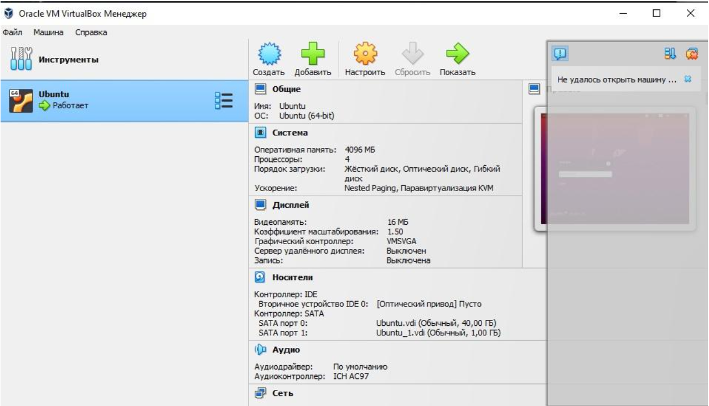
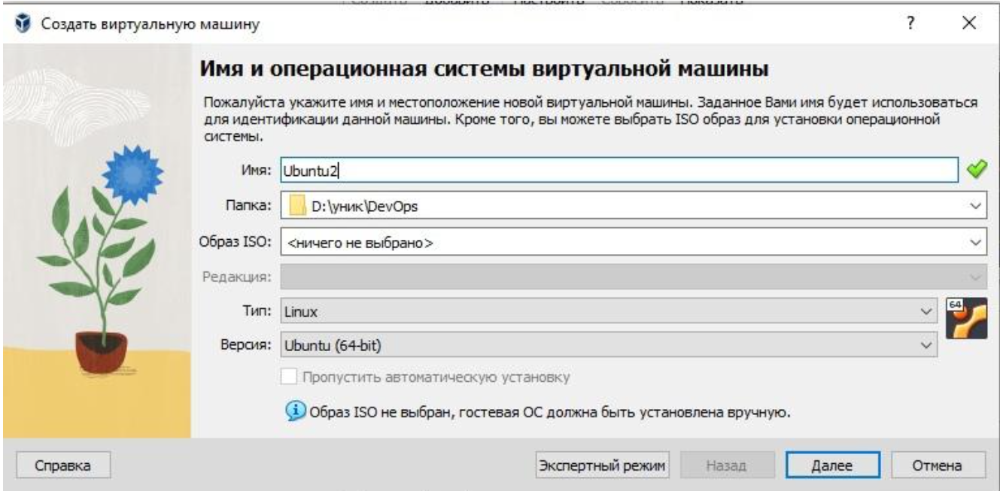
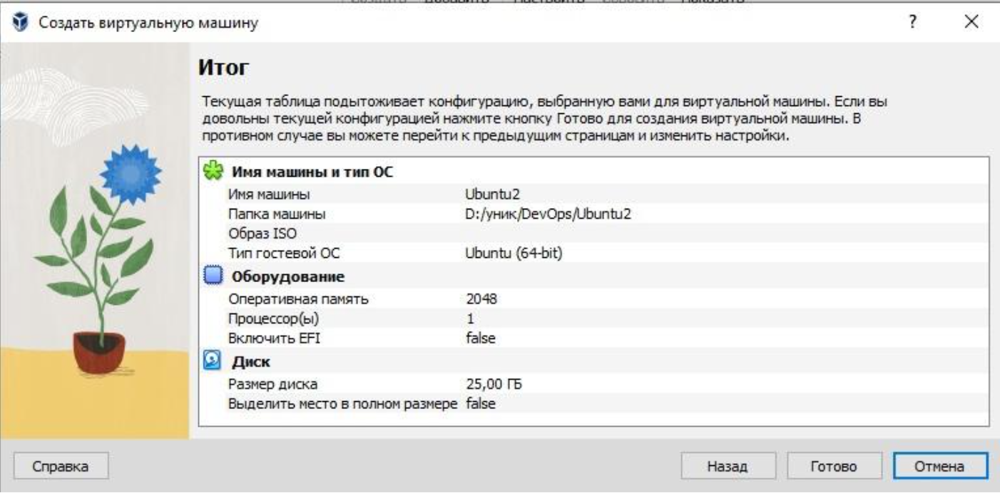
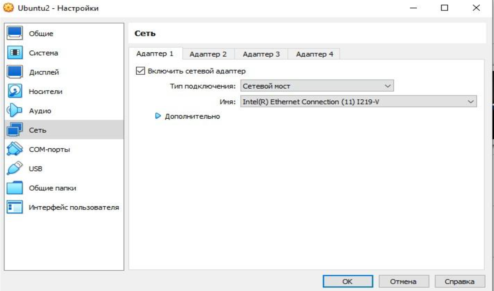
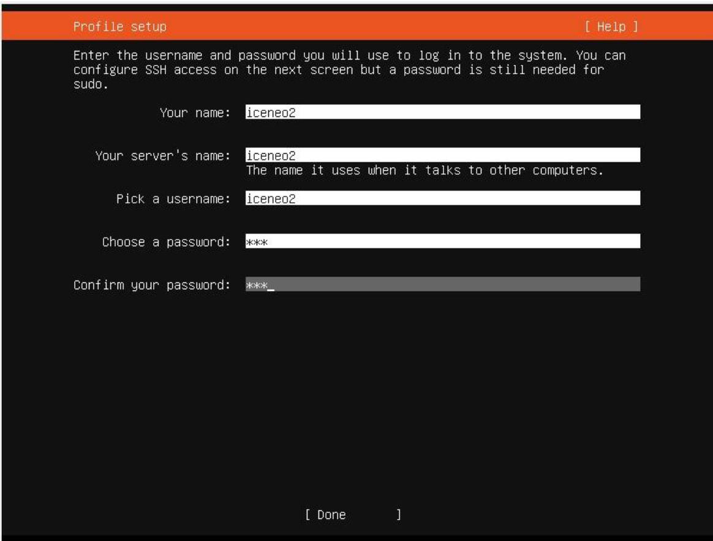
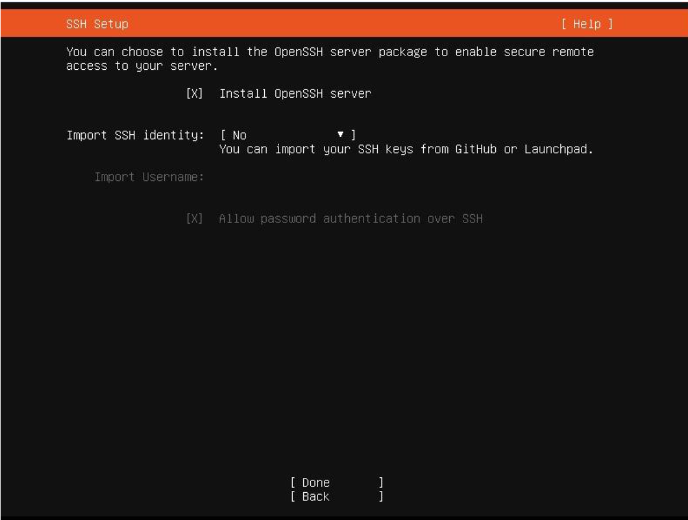
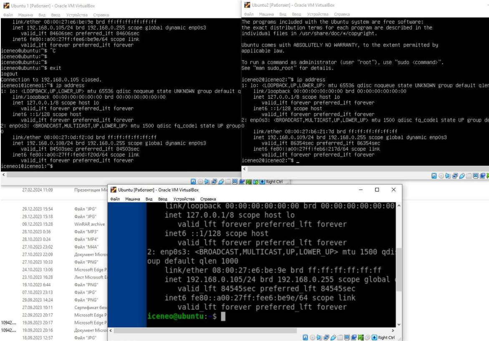
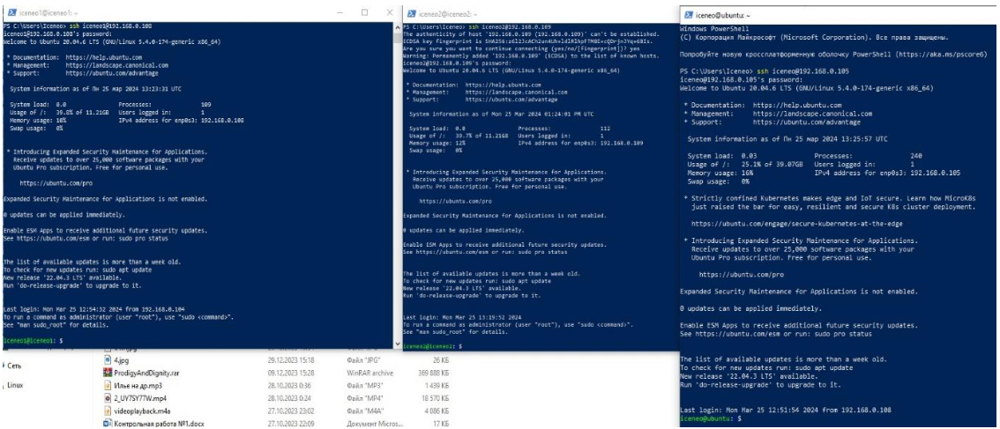
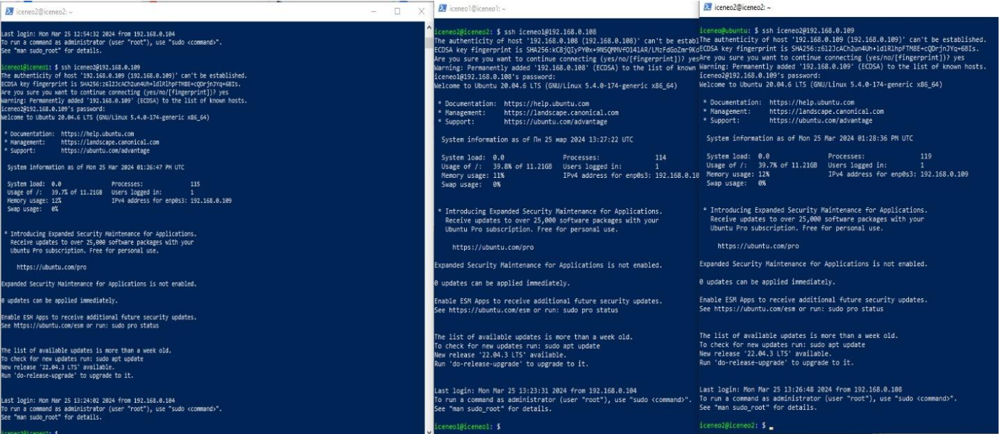

# Министерство образования и науки Российской Федерации
## Федеральное государственное автономное образовательное учреждение высшего образования
## «Уральский федеральный университет имени первого Президента России Б. Н. Ельцина»

### Курс “DevOps: Виртуализация и облачные вычисления для бизнеса”

## Отчет
### По практической работе №1
### «Основы OS»

#### Выполнил:
Силинкин Иван, РИ-310932

г. Екатеринбург

---

## Введение
**Цель работы:**
Создать три виртуальные машины внутри гипервизора Oracle VirtualBox и настроить между ними SSH-подключение.

**Задачи:**
1. Создать недостающие узлы внутри гипервизора и поместить их в одну сеть.
2. Проверить SSH-подключение между узлами.

---

## Оглавление
1. Введение
2. Ход работы:
    - Создание узлов в гипервизоре
    - Проверка SSH-подключения
3. Вывод

---

## Ход работы:

### Создание узлов в гипервизоре

На момент выполнения практической работы в гипервизоре уже присутствовал один узел с установленной OC Linux Ubuntu Server (Рисунок 1).

Создадим недостающие узлы (Рисунки 2 и 3).

Также в настройках сети узла изменим тип подключения на сетевой мост (Рисунок 4).

Теперь приступим к установке операционной системы в машину (Рисунок 5).

Проставляем галочку напротив предложения установить OpenSSH (Рисунок 6).

По аналогии конфигурируем и устанавливаем ОС для последнего узла.

### Проверка SSH-подключения

После установки всех ОС открываем их терминал и проверяем ip-адреса командой `ip address` (Рисунок 7).

Узнав ip-адреса подключаемся к каждой из машин через SSH используя Windows Powershell (Рисунок 8).

Получив доступ ко всем машинам последовательно подключимся из них к другим машинам (Рисунок 9).

Из рисунка 9 следует что SSH настроен верно для всех узлов.

---

## Вывод

В ходе данной практической работы были созданы и настроены две дополнительные виртуальные машины в гипервизоре Oracle VirtualBox. Все виртуальные машины были объединены в одну сеть, и на них была установлена ОС Linux Ubuntu Server 20.04 с активированным OpenSSH сервером. Проверка SSH-подключения показала, что настройка была выполнена правильно, и все узлы могут успешно взаимодействовать друг с другом через SSH.