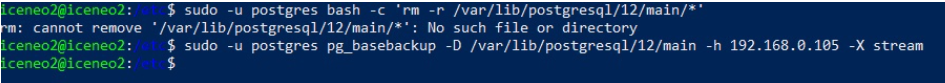

# Министерство образования и науки Российской Федерации
## Уральский федеральный университет имени первого Президента России Б. Н. Ельцина

### Курс “DevOps: Виртуализация и облачные вычисления для бизнеса”

## Отчет по практической работе №2
### «Построение кластера»

#### Выполнил:
Силинкин Иван, РИ-310932

г. Екатеринбург

---

## Введение
**Цель работы:**
Соединить три виртуальные машины в единый кластер с использованием Pacemaker.

**Задачи:**
1. Добавить IP-адреса других узлов в файл `/etc/hosts` на всех узлах.
2. Синхронизировать время между узлами.
3. Настроить обмен через SSH-ключи.
4. Установить пакет Pacemaker и создать кластер.
5. Произвести первоначальную настройку кластера.
6. Настроить СУБД PostgreSQL.
7. Создать ресурсы кластера.
8. Ознакомиться с ресурсами фенсинга.

---

## Оглавление
1. Введение
2. Ход работы:
    - Создание узлов в гипервизоре
    - Синхронизация времени узлов
    - Настройка обмена через SSH-ключи
    - Установка пакета Pacemaker
    - Первоначальная настройка кластера
    - Настройка СУБД PostgreSQL
    - Создание ресурса кластера
    - Ознакомление с ресурсами фенсинга
3. Вывод

---

## Ход работы

### Создание узлов в гипервизоре

Подключаемся к одному из узлов по SSH и редактируем файл `/etc/hosts` для добавления IP-адресов других узлов.

Повторяем эту операцию для всех остальных узлов.

### Синхронизация времени узлов

Проверяем синхронизацию времени между узлами с помощью команды `date`.

### Настройка обмена через SSH-ключи

Генерируем SSH-ключ командой `ssh-keygen`.

Копируем сгенерированный ключ на другие узлы командой `ssh-copy-id`.

Теперь можно подключаться по SSH без ввода пароля.

Настраиваем SSH для ОС Windows, чтобы подключаться напрямую из Powershell без ввода пароля.

Пишем BASH-скрипт для копирования ключа, так как в Windows отсутствует команда `ssh-copy-id`.

Используем этот скрипт для копирования ключа на узлы Ubuntu.

Проверяем возможность подключения по SSH без пароля через Windows Powershell.

### Установка пакета Pacemaker

Устанавливаем пакеты `pacemaker`, `fence-agents` и `postgresql` на каждый из узлов.

Заменяем несовместимую версию пакета `resource-agents` на совместимую версию 4.7.0.

### Первоначальная настройка кластера

Меняем пароль пользователя `hacluster`.

Проводим аутентификацию всех узлов в кластере, указав пользователя `hacluster` и его новый пароль.

Настраиваем автоматический запуск кластера при старте системы.

Проверяем статус кластера и синхронизацию его узлов.

### Настройка СУБД PostgreSQL

Отключаем запуск `postgresql.service` при старте системы, так как теперь за это будет отвечать Pacemaker.

Инициализируем и запускаем новую БД на мастер-узле.

Сменяем пароль пользователя `postgres`.

Создаем пользователя для репликации.

Редактируем `pg_hba.conf` для установки необходимых разрешений.

Изменяем `postgresql.conf`.

Перезапускаем `postgresql` на мастер-узле.

Очищаем директорию `postgresql/12/main` на остальных узлах и копируем БД с мастер-узла.

### Создание ресурса кластера

Создаем ресурс типа `IPaddr` для подключения к БД PostgreSQL.

Создаем ресурс типа `pgsql` для управления конфигурацией PostgreSQL.

Связываем два созданных ресурса, чтобы они запускались вместе на одном узле, и устанавливаем им очередность запуска.

### Ознакомление с ресурсами фенсинга

Выводим список всех доступных `fence-agents`.

Используем агент `fence_virsh`.

---

## Вывод

В ходе данной практической работы была произведена настройка привязки машины за ее IP-адресом путем редактирования файла `/etc/hosts`. Также была проверена синхронизация времени между тремя узлами ОС Linux Ubuntu Server 20.04. На каждой машине был настроен обмен через SSH путем генерации уникального ключа командой `ssh-keygen` и дальнейшего копирования его публичной части на другие машины командой `ssh-copy-id`. Для ОС Windows был написан Bash-скрипт, имитирующий тот же функционал в связи с отсутствием команды в системе. После этого был установлен пакет Pacemaker для создания кластера из трех узлов. Так как зависимость `resource-agents`, включенная в данный пакет, оказалась несовместимой с PostgreSQL 12, была произведена установка другой версии зависимости. После установки пакета все
