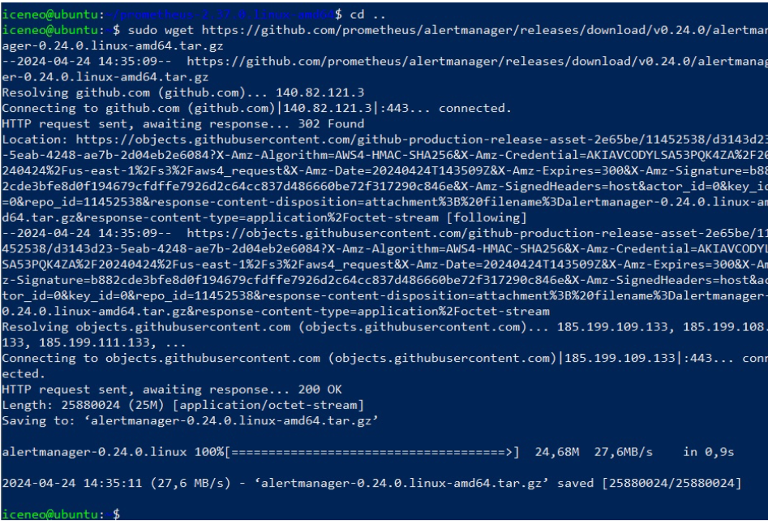

# Министерство образования и науки Российской Федерации
## Уральский федеральный университет имени первого Президента России Б. Н. Ельцина

### Курс “DevOps: Виртуализация и облачные вычисления для бизнеса”

## Отчет по практической работе №3
### «Мониторинг, логирование и оповещение событий»

#### Выполнил:
Силинкин Иван, РИ-310932

г. Екатеринбург

---

## Введение
**Цель работы:**
Установить и настроить системы мониторинга Prometheus, AlertManager и node_exporter на виртуальной машине.

**Задачи:**
1. Синхронизировать время на машине и открыть необходимые порты для систем мониторинга.
2. Установить и настроить Prometheus.
3. Установить и настроить AlertManager.
4. Установить и настроить node_exporter.
5. Связать AlertManager и node_exporter с Prometheus.
6. Настроить мониторинг служб Linux.

---

## Оглавление
1. Введение
2. Ход работы:
    - Синхронизация времени и открытие портов для систем мониторинга
    - Установка и настройка Prometheus
    - Установка и настройка AlertManager
    - Установка и настройка node_exporter
    - Связка AlertManager и node_exporter с Prometheus
    - Мониторинг служб Linux
3. Вывод

---

## Ход работы

### Синхронизация времени и открытие портов для систем мониторинга

Для синхронизации времени на виртуальной машине используем пакет `chrony`, который уже был установлен в систему.

Затем открываем необходимые TCP и UDP порты, которые будут использоваться системами мониторинга.

Так как на машине установлена Linux Ubuntu, SELinux не активен.

### Установка и настройка Prometheus

Первым шагом необходимо скачать пакет Prometheus для Linux.

После скачивания архива `prometheus`, распаковываем его и распределяем содержимое по различным каталогам. Создаем необходимые директории.

Распределяем разархивированные файлы по соответствующим каталогам.

Далее создаем пользователя, от имени которого будет запускаться система мониторинга Prometheus.

Закрепляем ранее созданные каталоги за новым пользователем и запускаем Prometheus.

Проверяем, что Prometheus запущен, перейдя по адресу хоста и порту 9090.

Для удобства настраиваем автозапуск системы, создав конфигурационный файл `prometheus.service`.

Перечитываем конфигурацию, разрешаем автозапуск и проверяем корректность работы службы.

### Установка и настройка AlertManager

Скачиваем пакет AlertManager для Linux.

Создаем необходимые каталоги и распаковываем скачанный архив.

Распределяем файлы по соответствующим каталогам.

Создаем пользователя, от имени которого будет запускаться AlertManager.

Настраиваем автозапуск, создав файл `alertmanager.service`.

Проверяем, что AlertManager запущен, перейдя по адресу хоста и порту 9093.

### Установка и настройка node_exporter

Скачиваем пакет node_exporter для Linux.

Распаковываем скачанный архив и копируем его содержимое по пути `/usr/local/bin`.

Создаем пользователя, от имени которого будет запускаться node_exporter.

Настраиваем автозапуск, создав файл `node_exporter.service`.

Проверяем, что node_exporter запущен, перейдя по адресу хоста и порту 9100.

### Связка AlertManager и node_exporter с Prometheus

Для интеграции node_exporter и AlertManager с Prometheus, добавляем адрес машины, на которой запущен node_exporter, в файл `prometheus.yml`.

Проверяем, что во вкладке Targets системы мониторинга Prometheus отображаются метрики node_exporter.

Теперь интегрируем AlertManager в Prometheus. Создаем правило `alert.rules.yml` и подключаем его в `prometheus.yml`.

Отключаем службу node_exporter и проверяем наличие уведомления об этом во вкладке Alerts.

Настраиваем отправку уведомлений на почту в случае недоступности службы node_exporter.

### Мониторинг служб Linux

Для мониторинга сервисов с помощью Prometheus настраиваем сбор метрик и отображение тревог. Изменяем файл `node_exporter.service` для мониторинга всех служб, кроме `auditd`, `dbus` и `kdump`.

Настраиваем мониторинг для Nginx, создав новое правило в файле `services.rules.yml`.

Перезагружаем Prometheus, останавливаем nginx и проверяем, что пришло уведомление о его отключении.

---

## Вывод

В ходе данной практической работы была проведена синхронизация времени на машине с помощью пакета chrony для корректной работы пакетов мониторинга системы: Prometheus, AlertManager и node_exporter. Для каждого из пакетов были открыты требуемые UDP и TCP порты с помощью команды `ufw allow`. Все пакеты были загружены в виде архивов с соответствующих репозиториев GitHub. После распаковки и размещения файлов по каталогам, для каждой системы мониторинга был создан пользователь, от имени которого запускалась служба. После проверки работоспособности мониторинговых систем, для них был настроен автозапуск посредством создания файлов `prometheus.service`, `alertmanager.service` и `node_exporter.service`. Было настроено отображение метрик node_exporter внутри Prometheus путем добавления нового job_name в файл `prometheus.yml` и указания адреса машины, на которой запущен node_exporter. При потере соединения с node_exporter во вкладке Alerts отображается уведомление о недоступности службы. Также была настроена отправка уведомлений по протоколу SMTP на почту в случае события InstanceDown. Помимо интеграции с другими системами мониторинга, было настроено отслеживание состояния службы nginx путем создания файла `services.rules.yml`, который был подключен в конфиг `prometheus.yml`.
