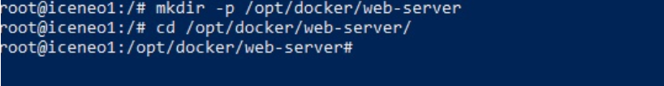
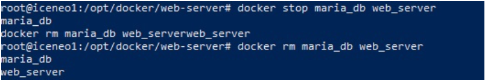

# Министерство образования и науки Российской Федерации
## Уральский федеральный университет имени первого Президента России Б. Н. Ельцина

### Курс “DevOps: Виртуализация и облачные вычисления для бизнеса”

## Отчет по практической работе №7
### «Практические навыки работы с Docker»

#### Выполнил:
Силинкин Иван, РИ-310932

г. Екатеринбург

---

## Введение
**Цель работы:**
Установить Docker и настроить веб-сервер, состоящий из NGINX, PHP и MariaDB.

**Задачи:**
1. Установить и настроить Docker.
2. Произвести конфигурацию и запуск контейнеров по отдельности.
3. Запустить несколько контейнеров с использованием docker-compose.

---

## Оглавление
1. Введение
2. Ход работы:
    - Установка и настройка Docker
    - Конфигурация и запуск контейнеров по отдельности
    - Запуск нескольких контейнеров через docker-compose
3. Вывод

---

## Ход работы

### Установка и настройка Docker

Для начала обновим информацию о доступных пакетах командой `apt-get update`, а затем установим Docker командой `apt-get install`.

Разрешим автозапуск Docker и проверим его работоспособность, запустив контейнер с образом hello-world.

Настроим сервис Docker, создав файл конфигурации `daemon.json`, в который внесем информацию о хранении логов и служебных файлов. После этого перезагрузим сервис.

Установим команду `docker-compose`, скачав необходимые файлы и предоставив им права на исполнение.

### Конфигурация и запуск контейнеров по отдельности

Запуск контейнеров в Docker осуществляется на основе образа, который формируется по набору команд из `Dockerfile`. Начнем с создания директории, где будут храниться данные для создания образа веб-сервера.

Создадим `Dockerfile`, по которому будет строиться образ веб-сервера.

Одной из команд в `Dockerfile` является `COPY ./html/`, поэтому создадим эту директорию в одной папке с `Dockerfile`. Эти данные будут использоваться NGINX для раздачи страницы.

Для демонстрации будем использовать простой php-файл, который выводит информацию о системе.

Построим образ по созданному `Dockerfile`.

Так как порт доступа к контейнеру задан командой `EXPOSE 80`, временно отключим NGINX, работающий на машине на том же порту. Запустим контейнер и проверим результат, перейдя по ссылке.

Для запуска СУБД воспользуемся готовым образом MariaDB. Поскольку после остановки контейнера все данные внутри него удаляются, подключим внешний том для хранения данных БД.

Создадим том для Docker.

Выполним первый запуск контейнера с MariaDB, задав через системные переменные пароль для root-пользователя.

Подключимся к терминалу MariaDB и зададим новый пароль для root-пользователя.

Перезапустим контейнер без системных переменных и автоудаления после остановки.

Теперь наши серверы готовы к работе по отдельности. Настроим их так, чтобы веб-сервер мог подключаться к СУБД.

Подключимся к терминалу СУБД и создадим базу данных под названием `docker_db`. Доступ к этой базе предоставим пользователю `docker_db_user`.

Для возможности коммуникации между контейнерами создадим общую сеть. Остановим текущий контейнер и запустим контейнеры с БД и веб-сервером в одной сети `net1`.

Изменим содержимое `index.php` для подключения к БД.

Пересоберем образ веб-сервера из-за изменения содержимого страницы и перезапустим контейнер. Проверим, что при переходе по URL машины нет ошибок.

### Запуск нескольких контейнеров через docker-compose

С помощью `docker-compose` можно запускать проекты, состоящие из нескольких контейнеров, одной командой. Сначала удалим контейнеры, созданные на предыдущих этапах.

Создадим файл `docker-compose.yml`, где укажем два сервиса: веб-сервер и MariaDB. Зададим им опцию перезагрузки при рестарте системы с помощью параметра `restart: always`.

Создадим образы по указанным в файле сервисам командой `docker compose build` и запустим все контейнеры командой `docker-compose up -d`. Проверим, что всё работает корректно.

---

## Вывод

В ходе данной практической работы была произведена установка Docker на систему Linux Ubuntu Server, и настроен его автозапуск. Помимо самого Docker, была установлена команда docker-compose, которая позволяет автоматизировать запуск нескольких контейнеров. В конфигурационном файле `daemon.json` были указаны настройки записи служебных файлов для Docker.

Для тестирования был запущен веб-сервер NGINX и СУБД MariaDB в отдельных контейнерах. В контейнер с NGINX был скопирован файл `index.php`, который изначально выводил системную информацию, а затем был изменён для подключения к БД в MariaDB. Для сохранения данных БД после остановки контейнера был создан и подключен внешний том. 

Для возможности коммуникации между контейнерами была создана общая сеть `net1`. В дальнейшем запуск контейнеров был автоматизирован с помощью docker-compose, который автоматически создаёт общую сеть для контейнеров, указанных в файле `docker-compose.yml`.